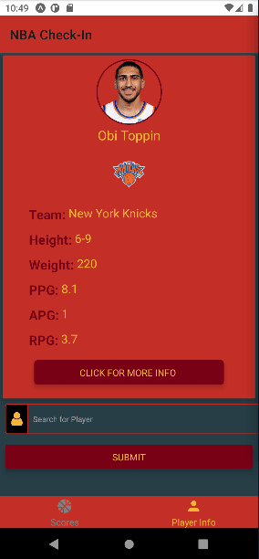
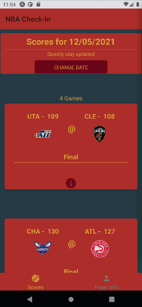
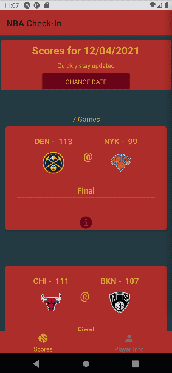

<h1 align="center">React Native app made with Expo, created to replace having to google basic NBA schedules and stats</h1>
<p>
  <a href="https://twitter.com/universallyry" target="_blank">
    
  </a>
</p>

> Check NBA schedules, scores and stats

## Main Resources Used

- [NodeJS](https://nodejs.org/en/download/)
- [expo](https://expo.io/)
- [native-base](https://nativebase.io/)
- [moti](https://moti.fyi/)

## Install

```sh
npm install
```

**or**

```sh
yarn
```

## Usage

```sh
expo start
```

**or**

```sh
npm start
```

## About

React Native app created with Expo, animated using Moti and styled with native-base. Made for my friends, and I, to keep up with the NBA. Feel free to use and take anything for your own sports app.:thumbsup::thumbsup:

Only developed in Expo/Android so no idea on how the NBA api handles in production. Paths sometimes changes due to request to NBA's official api.

Bugs- No Preseason support(Team scores, game stats, playerstats).

## Demo

<table>
  <tr>
    <td>Player Profile</td>
    <td>Search Check</td>
    <td>Extended Game Summary</td>
    <td>Date Change</td>
  </tr>
  <tr>
    <td valign="top"></td>
    <td valign="top"></td>
    <td valign="top"></td>
    <td valign="top"></td>
  </tr>
 </table>

## Made by:

👤 **Ryan Paige**

- Twitter: [@universallyry](https://twitter.com/universallyry)
- Github Profile: [@universallyry](https://github.com/universallyry)

---

_This README was generated with ❤️ by [readme-md-generator](https://github.com/kefranabg/readme-md-generator)_
